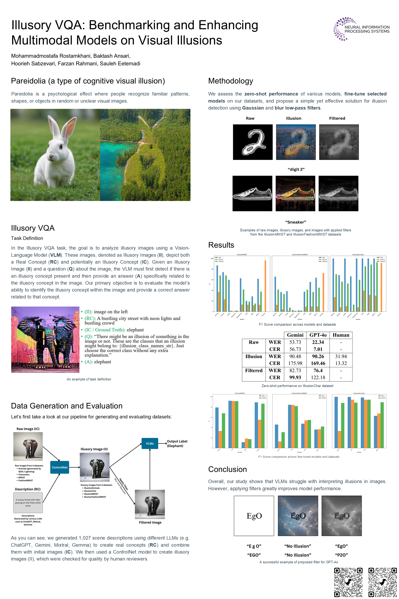

# Illusory VQA

**Benchmarking and enhancing multimodal models on visual illusions**

[Paper](https://arxiv.org/abs/2412.08169) ·
[Datasets](https://huggingface.co/VQA-Illusion) ·
[Presentation](https://recorder-v3.slideslive.com/#/share?share=97904&s=90373c05-e3d3-419b-af24-fd160ac8c1f3) ·
[Slides](./Slides.pdf) ·
[Poster](./IllusoryVQA_Poster.png)

This repository contains the experiment notebooks and released results for **Illusory VQA**, a benchmark for studying how multimodal and vision-language models recognize visual illusions. The project introduces four datasets spanning image classification and optical character recognition:

- **IllusionMNIST**
- **IllusionFashionMNIST**
- **IllusionAnimals**
- **IllusionChar**

The paper was presented as a Spotlight Paper at the Multimodal Algorithmic Reasoning Workshop at [NeurIPS 2024](https://marworkshop.github.io/neurips24/) and [CVPR 2025](https://marworkshop.github.io/cvpr25/).

## Overview

Standard visual question answering benchmarks rarely test images that support competing perceptual interpretations. Illusory VQA addresses this gap with synthetically generated scenes containing hidden digits, clothing categories, animals, or alphanumeric sequences.

The repository supports three main lines of evaluation:

1. **Zero-shot evaluation** of multimodal and vision-language models.
2. **Fine-tuning** on illusion-aware training data.
3. **Image preprocessing**, using the filtering pipeline described in the paper to make hidden content easier for models to detect.

The released experiments compare models across source-condition images, illusory images, and filtered images. The public test datasets additionally include matched illusionless controls.

## Datasets

Each benchmark is distributed as separate train and test repositories on Hugging Face.

| Benchmark | Task | Training set | Test set | Primary metrics |
| --- | --- | --- | --- | --- |
| IllusionMNIST | Hidden-digit classification | [MNIST_train](https://huggingface.co/datasets/VQA-Illusion/MNIST_train) | [MNIST_test](https://huggingface.co/datasets/VQA-Illusion/MNIST_test) | Accuracy, precision, recall, F1 |
| IllusionFashionMNIST | Hidden-clothing classification | [FashionMnist_train](https://huggingface.co/datasets/VQA-Illusion/FashionMnist_train) | [FashionMnist_test](https://huggingface.co/datasets/VQA-Illusion/FashionMnist_test) | Accuracy, precision, recall, F1 |
| IllusionAnimals | Hidden-animal classification | [IllusionAnimals_train](https://huggingface.co/datasets/VQA-Illusion/IllusionAnimals_train) | [IllusionAnimals_test](https://huggingface.co/datasets/VQA-Illusion/IllusionAnimals_test) | Accuracy, precision, recall, F1 |
| IllusionChar | Hidden-sequence transcription | [IllusionChar_train](https://huggingface.co/datasets/VQA-Illusion/IllusionChar_train) | [IllusionChar_test](https://huggingface.co/datasets/VQA-Illusion/IllusionChar_test) | Character error rate, word error rate |

Refer to the README in each dataset repository for its exact directory structure, current hosted sample counts, metadata schema, and loading example.

### Image conditions

| Condition | Description | Expected target |
| --- | --- | --- |
| Raw / source-condition | Original digit, clothing, animal, or sequence image used to guide generation | Original class or sequence |
| Illusion | Generated scene containing the hidden target | Original class or sequence |
| Filtered illusion | Illusion image processed with the proposed filter pipeline | Original class or sequence |
| Illusionless | Matched scene without an embedded target | No illusion |
| Filtered illusionless | Filtered version of an illusionless scene | No illusion |

The public test repositories provide the five conditions as aligned directories. Files with the same `image_name` stem belong to the same base example.

### Classification label mapping

The following class order is used throughout the experiment notebooks:

| ID | IllusionMNIST | IllusionFashionMNIST | IllusionAnimals |
| ---: | --- | --- | --- |
| 0 | digit 0 | T-shirt/top | cat |
| 1 | digit 1 | Trouser | dog |
| 2 | digit 2 | Pullover | pigeon |
| 3 | digit 3 | Dress | butterfly |
| 4 | digit 4 | Coat | elephant |
| 5 | digit 5 | Sandal | horse |
| 6 | digit 6 | Shirt | deer |
| 7 | digit 7 | Sneaker | snake |
| 8 | digit 8 | Bag | fish |
| 9 | digit 9 | Ankle boot | rooster |
| 10 | No illusion | No illusion | No illusion |

Dataset CSV storage is not identical across benchmarks:

- IllusionMNIST and IllusionFashionMNIST store primary classes as numeric values.
- IllusionAnimals stores animal names as strings.
- IllusionChar stores an exact, case-sensitive 3–5 character transcription and does not use a fixed class-ID mapping.

Normalize `No illusion` labels explicitly when combining datasets or comparing notebook outputs.

## Repository structure

~~~text
IllusoryVQA/
├── Experiments/
│   ├── Fine-Tuned/
│   │   ├── BLIP/
│   │   ├── BLIP-2/
│   │   ├── CLIP/
│   │   └── LLaVA/
│   └── Zero-Shot/
│       ├── BLIP/
│       ├── BLIP-2/
│       ├── CLIP/
│       ├── GPT-4o/
│       ├── Gemini/
│       ├── KOSMOS-2/
│       ├── LLaVA/
│       └── miniGPT_V2/
├── Results/
│   ├── Fine-Tuned/
│   ├── Zero-Shot/
│   └── Human-Evaluation/
├── IllusoryVQA_Poster.png
├── Slides.pdf
├── LICENSE
└── README.md
~~~

### Experiments

- [`Experiments/Fine-Tuned/`](./Experiments/Fine-Tuned/) contains training and inference notebooks for BLIP, BLIP-2, CLIP, and LLaVA.
- [`Experiments/Zero-Shot/`](./Experiments/Zero-Shot/) contains inference and metric notebooks for BLIP, BLIP-2, CLIP, GPT-4o, Gemini, KOSMOS-2, LLaVA, and MiniGPT-V2.

### Results

- [`Results/Fine-Tuned/`](./Results/Fine-Tuned/) contains released outputs for fine-tuned models.
- [`Results/Zero-Shot/`](./Results/Zero-Shot/) contains released zero-shot predictions and evaluations.
- [`Results/Human-Evaluation/`](./Results/Human-Evaluation/) contains the four human-annotation result files used by the project.

## Model coverage

| Model | Zero-shot | Fine-tuned |
| --- | :---: | :---: |
| BLIP | ✓ | ✓ |
| BLIP-2 | ✓ | ✓ |
| CLIP | ✓ | ✓ |
| LLaVA | ✓ | ✓ |
| GPT-4o | ✓ | — |
| Gemini | ✓ | — |
| KOSMOS-2 | ✓ | — |
| MiniGPT-V2 | ✓ | — |

IllusionChar was evaluated with GPT-4o and Gemini. The paper did not fine-tune models on IllusionChar because of the reported hardware constraints.

## Quick start

### 1. Clone the repository

~~~bash
git clone https://github.com/IllusoryVQA/IllusoryVQA.git
cd IllusoryVQA
~~~

### 2. Create a Python environment

The repository contains research notebooks created for different model stacks, so dependencies vary by experiment. Start with an isolated environment:

~~~bash
python -m venv .venv
source .venv/bin/activate
python -m pip install --upgrade pip
pip install jupyterlab huggingface_hub pandas pillow
~~~

Then open the selected notebook and install the model-specific packages listed in its setup cells. Some experiments require GPU runtimes, model checkpoints, or provider API access.

### 3. Download a dataset

~~~python
from huggingface_hub import snapshot_download

dataset_dir = snapshot_download(
    repo_id="VQA-Illusion/MNIST_test",
    repo_type="dataset",
)
print(dataset_dir)
~~~

Replace the repository ID with any dataset listed above.

### 4. Run an experiment

1. Choose a notebook under `Experiments/Zero-Shot/` or `Experiments/Fine-Tuned/`.
2. Update its dataset and output paths for your environment.
3. Configure any model checkpoints or API credentials required by that notebook.
4. Run the notebook from top to bottom.
5. Compare generated outputs with the corresponding files under `Results/`.

Never commit API keys, access tokens, or private checkpoint credentials.

## Reproducibility notes

- Several notebooks were developed in Google Colab or Kaggle and contain environment-specific paths. Replace those paths before running locally.
- Package requirements differ across model families; use separate environments if dependency versions conflict.
- Treat each dataset's `df_data.csv` as its authoritative index. Top-level image directories represent image conditions, not semantic class labels.
- Keep all variants sharing an `image_name` in the same partition when creating derived splits.
- Preserve case for IllusionChar evaluation.
- The paper and current public repositories may report different sample counts. Use the hosted metadata files for release-specific reproduction and state the dataset revision in new experiments.

## Filtering method

Appendix K of the paper describes the preprocessing pipeline:

1. Gaussian blur;
2. averaging blur;
3. median blur;
4. grayscale conversion; and
5. sharpening.

The test repositories include the released filtered outputs, allowing direct comparison without regenerating them.

## Responsible use and limitations

The datasets were created for research on visual perception, multimodal robustness, classification, OCR, and VQA. The paper reports human validation and NSFW screening of the public release.

Important limitations include:

- a focus on classification and OCR rather than general open-ended VQA;
- primarily one large hidden target per image;
- synthetically generated scenes and illusions;
- limited analysis of color changes; and
- possible model-specific sensitivity to prompting and preprocessing.

Users should document dataset revisions, prompt templates, preprocessing, and answer-normalization rules when reporting results.

## Citation

If you use the datasets, code, or results, please cite:

~~~bibtex
@misc{rostamkhani2024illusoryvqa,
  title         = {Illusory VQA: Benchmarking and Enhancing Multimodal Models on Visual Illusions},
  author        = {Rostamkhani, Mohammadmostafa and Ansari, Baktash and Sabzevari, Hoorieh and Rahmani, Farzan and Eetemadi, Sauleh},
  year          = {2024},
  eprint        = {2412.08169},
  archivePrefix = {arXiv},
  primaryClass  = {cs.CV},
  url           = {https://arxiv.org/abs/2412.08169}
}
~~~

## License

The code in this repository is released under the [MIT License](./LICENSE). Review the dataset cards and applicable upstream terms before redistributing dataset assets.

## Contact

For questions or reproducibility issues, open a [GitHub issue](https://github.com/IllusoryVQA/IllusoryVQA/issues) or contact:

- [Mohammadmostafa Rostamkhani](mailto:mohammadmostafarostamkhani@gmail.com)
- [Baktash Ansari](mailto:baktash.ansari1381@gmail.com)
- [Hoorieh Sabzevari](mailto:hoorieh95@gmail.com)
